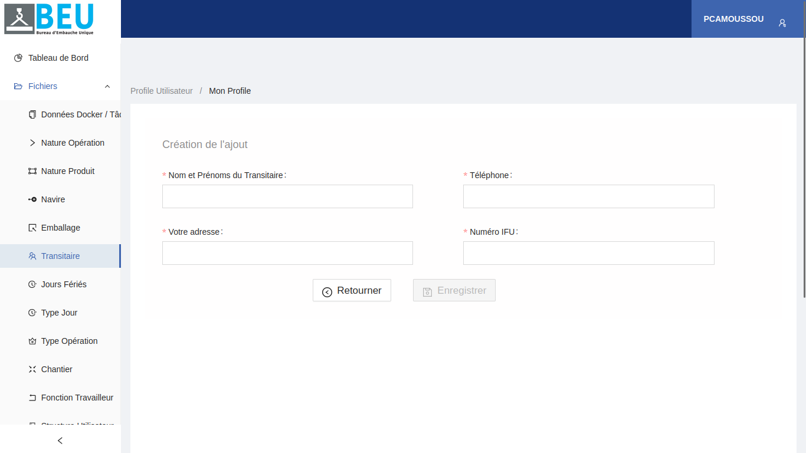

# Bureau d'Embauche Unique (BEU) - Documentation

## Page de connexion

La page de connexion vous permet d'accéder à votre compte BEU en entrant vos identifiants. Voici les éléments clés de cette page :

1. **Logo BEU**: Le logo de l'application Bureau d'Embauche Unique.
2. **Champ d'identifiant**: Entrez votre identifiant.
3. **Champ de mot de passe**: Entrez votre mot de passe.
4. **Lien "Mot de passe oublié ?"**: Cliquez sur ce lien si vous avez oublié votre mot de passe.
5. **Bouton "Se Connecter"**: Cliquez sur ce bouton une fois vos identifiants entrés pour vous connecter.

Une fois connecté, vous pourrez accéder aux différentes fonctionnalités de l'application BEU.

## Accéder au profil

Pour accéder à votre profil utilisateur, cliquez sur le menu latéral "Profils Utilisateur" > "Mon Profil" comme illustré ci-dessous :

Vous pouviez également vous déconnectez en cliquant sur "déconnexion"

## Afficher les informations de profil

La section "Mon Profil" affiche les informations détaillées de votre compte utilisateur, notamment :

- Nom et prénoms
- Rôle au sein de l'application
- Structure à laquelle vous appartenez

## Modifier le profil

Pour modifier les informations de votre profil, cliquez sur le bouton "Modifier" et changer les informations au niveau des champs du formulaire voulu.

Une fois les modifications apportées, cliquez sur "Mettre à jour" pour enregistrer les changements.

## Liste des dockers et tâcherons

Cette section permet de consulter et rechercher la liste complète des dockers et tâcherons enregistrés dans le système.

### Filtres de recherche

Plusieurs filtres sont disponibles pour faciliter la recherche de dockers ou tâcherons spécifiques : Cliquer sur le bouton "Cliquez ici pour faire une recherche avancée" pour rechercher.

- **Badge** : Rechercher par le numéro de badge.
- **Matricule** : Rechercher par le matricule.
- **Numéro d'appel** : Rechercher par le numéro d'appel.
- **Nom** : Rechercher par le nom.
- **Prénoms** : Rechercher par les prénoms.
- **Téléphone** : Rechercher par le numéro de téléphone.
- **Fonction** : Rechercher par la fonction occupée.

### Résultats

La liste affiche les informations suivantes pour chaque docker ou tâcheron :

- **Badge** : Le numéro de badge attribué.
- **Nom** : Le nom de famille.
- **Prénoms** : Les prénoms.
- **Statut** : Le statut actuel (libre ou occupé).
- **Matricule** : Le matricule d'identification.
- **Téléphone** : Le numéro de téléphone.
- **Fonction** : La fonction occupée.
- **Action** : Un bouton d'action permettant d'accéder aux détails ou de modifier les informations.

- Par contre , cliquer sur le bouton de suppression supprimera le docker ou le tacheron.

## Liste des natures d'opération

La page de liste des natures d'opération affiche toutes les natures d'opération existantes dans un tableau. Chaque ligne du tableau contient les informations suivantes :

- Code
- Nom de la nature d'opération
- Type de paie
- Date de création
- Actions (Modifier, Supprimer)

### Modification d'une Nature d'Opération

Pour modifier une nature d'opération :

1. Cliquez sur le bouton de modification (icône de crayon) situé dans la colonne "Actions" de la ligne correspondant à la nature d'opération que vous souhaitez modifier.
2. Vous serez redirigé vers une page de modification.
3. Modifiez les informations souhaitées et cliquez sur le bouton "Mettre à jour" pour sauvegarder les modifications.

### Suppression d'une Nature d'Opération

Pour supprimer une nature d'opération :

1. Cliquez sur le bouton de suppression (icône de poubelle) situé dans la colonne "Actions" de la ligne correspondant à la nature d'opération que vous souhaitez supprimer.
2. Une confirmation peut être demandée.
3. La nature d'opération sera supprimée de la liste.

### Ajouter une nature d'opération

Pour ajouter une nouvelle nature d'opération , cliquez sur le bouton d'ajout "Ajouter nature d'opération" en haut à gauche. Cela vous redirigera vers une page ou vous remplirez le formulaire d'ajout et cliquerez sur le bouton "Enregistrer"

## Liste des natures de produit

La page de liste des natures de produit affiche toutes les natures de produit existantes dans un tableau. Chaque ligne du tableau contient les informations suivantes :

- Code
- Nom de la nature de produit
- Date de création
- Actions (Modifier, Supprimer)

### Modification d'une Nature de produit

Pour modifier une nature de produit :

1. Cliquez sur le bouton de modification (icône de crayon) situé dans la colonne "Actions" de la ligne correspondant à la nature de produit que vous souhaitez modifier.
2. Vous serez redirigé vers une page de modification.
3. Modifiez les informations souhaitées et cliquez sur le bouton "Mettre à jour" pour sauvegarder les modifications.

### Suppression d'une Nature de produit

Pour supprimer une nature de produit :

1. Cliquez sur le bouton de suppression (icône de poubelle) situé dans la colonne "Actions" de la ligne correspondant à la nature de produit que vous souhaitez supprimer.
2. Une confirmation peut être demandée.
3. La nature de produit sera supprimée de la liste.

### Ajouter une nature de produit

Pour ajouter une nouvelle nature de produit , cliquez sur le bouton d'ajout "Ajouter nature de produit" en haut à gauche. Cela vous redirigera vers une page ou vous remplirez le formulaire d'ajout et cliquerez sur le bouton "Enregistrer"

## Navire

La page de liste des navires affiche tous les navires existantes dans le système dans un tableau. Chaque ligne du tableau contient les informations suivantes :

- Code OMI
- Nom du navire
- Actions (Modifier, Supprimer)

### Modification d'un navire

Pour modifier un navire:

1. Cliquez sur le bouton de modification (icône de crayon) situé dans la colonne "Actions" de la ligne correspondant au navire que vous souhaitez modifier.
2. Vous serez redirigé vers une page de modification.
3. Modifiez les informations souhaitées et cliquez sur le bouton "Mettre à jour" pour sauvegarder les modifications.

### Suppression d'un navires

Pour supprimer un navire :

1. Cliquez sur le bouton de suppression (icône de poubelle) situé dans la colonne "Actions" de la ligne correspondant au navire que vous souhaitez supprimer.
2. Une confirmation peut être demandée.
3. Le navire sera supprimé de la liste.

### Ajouter un navire

Pour ajouter un nouveau navire , cliquez sur le bouton d'ajout "Ajouter un navire" en haut à gauche. Cela vous redirigera vers une page ou vous remplirerez le formulaire d'ajout et cliquerez sur le bouton "Enregistrer"

### Rechercher un navire

Pour rechercher un navire , entrez dans le formulaire de recherche le nom ou le code OMI du navire. Cliquez ensuite sur le bouton de recherche.
La liste des navires trouvés s'affichera dans le tableau.

## Emballage

La page de liste des emballages affiche toutes les emballages existantes dans le système dans un tableau. Chaque ligne du tableau contient les informations suivantes :

- Nom de l'emballage
- Date de création
- Actions (Modifier, Supprimer)

### Modification d'une emballage

Pour modifier une emballage:

1. Cliquez sur le bouton de modification (icône de crayon) situé dans la colonne "Actions" de la ligne correspondant à l'emballage que vous souhaitez modifier.
2. Vous serez redirigé vers une page de modification.
3. Modifiez les informations souhaitées et cliquez sur le bouton "Mettre à jour" pour sauvegarder les modifications.

### Suppression d'une emballage

Pour supprimer une emballage :

1. Cliquez sur le bouton de suppression (icône de poubelle) situé dans la colonne "Actions" de la ligne correspondant à l'emballage que vous souhaitez supprimer.
2. Une confirmation peut être demandée.
3. L'emballage sera supprimée de la liste.

### Ajouter une emballage

Pour ajouter une nouvelle emballage , cliquez sur le bouton d'ajout "Ajouter" en haut gauche. Cela vous redirigera vers une page ou vous remplirerez le formulaire d'ajout et cliquerez sur le bouton "Enregistrer"

### Rechercher une emballage

Pour rechercher une emballage, entrez dans le formulaire de recherche le nom ou le nom de l'emballage. Cliquez ensuite sur le bouton de recherche.
La liste des emballages trouvées s'affichera dans le tableau.

## Transitaire

La page de liste des transitaires affiche tous les transitaires existantes dans le système dans un tableau. Chaque ligne du tableau contient les informations suivantes :

- Nom & prénoms
- Téléphone
- adresse
- Numéro IFU
- Actions (Modifier, Supprimer)

### Modification d'un transitaire

Pour modifier un transitaire:

1. Cliquez sur le bouton de modification (icône de crayon) situé dans la colonne "Actions" de la ligne correspondant au transitaire que vous souhaitez modifier.
2. Vous serez redirigé vers une page de modification.
3. Modifiez les informations souhaitées et cliquez sur le bouton "Mettre à jour" pour sauvegarder les modifications.

### Suppression d'un transitaire

Pour supprimer un transitaire :

1. Cliquez sur le bouton de suppression (icône de poubelle) situé dans la colonne "Actions" de la ligne correspondant au transitaire que vous souhaitez supprimer.

2. Une confirmation peut être demandée.
3. Le transitaire sera supprimé de la liste.

### Ajouter un transitaire

Pour ajouter un nouveau transitaire , cliquez sur le bouton d'ajout "Ajouter un transitaire" en haut à gauche. Cela vous redirigera vers une page ou vous remplirerez le formulaire d'ajout et cliquerez sur le bouton "Enregistrer"

### Rechercher un transitaire

Pour rechercher un transitaire , entrez dans le formulaire de recherche le nom ou autre information du transitaire. Cliquez ensuite sur le bouton de recherche.
La liste des transitaires trouvés s'affichera dans le tableau.

## Jour fériés

La page de liste des jours fériés affiche tous les jours fériés existants dans le système dans un tableau. Chaque ligne du tableau contient les informations suivantes :

- Jour férié
- Date
- Type de jour
- Date de création
- Actions (Modifier, Supprimer)

### Modification d'un jour férié

Pour modifier un jour férié:

1. Cliquez sur le bouton de modification (icône de crayon) situé dans la colonne "Actions" de la ligne correspondant au jour férié que vous souhaitez modifier.
2. Vous serez redirigé vers une page de modification.
3. Modifiez les informations souhaitées et cliquez sur le bouton "Mettre à jour" pour sauvegarder les modifications.

### Suppression d'un jour férié

Pour supprimer un jour férié :

1. Cliquez sur le bouton de suppression (icône de poubelle) situé dans la colonne "Actions" de la ligne correspondant au jour férié que vous souhaitez supprimer.
2. Une confirmation peut être demandée.
3. Le jour férié sera supprimé de la liste.

### Ajouter un jour férié

Pour ajouter un nouveau jour férié , cliquez sur le bouton d'ajout "Ajouter" en haut à gauche. Cela vous redirigera vers une page ou vous remplirerez le formulaire d'ajout et cliquerez sur le bouton "Enregistrer"

### Rechercher un jour férié

Pour rechercher un navire , entrez dans le formulaire de recherche la date ou autre information du jour férié. Cliquez ensuite sur le bouton de recherche.
La liste des jours fériés trouvés s'affichera dans le tableau.

## Type de jour

La page de liste des jours affiche tous les types de jours existants dans le système dans un tableau. Chaque ligne du tableau contient les informations suivantes :

- Code
- Type de jour
- Date de création
- Actions (Modifier, Supprimer)

### Modification d'un jour

Pour modifier un jour:

1. Cliquez sur le bouton de modification (icône de crayon) situé dans la colonne "Actions" de la ligne correspondant au jour que vous souhaitez modifier.
2. Vous serez redirigé vers une page de modification.
3. Modifiez les informations souhaitées et cliquez sur le bouton "Mettre à jour" pour sauvegarder les modifications.

### Suppression d'un jour

Pour supprimer un jour :

1. Cliquez sur le bouton de suppression (icône de poubelle) situé dans la colonne "Actions" de la ligne correspondant au navire que vous souhaitez supprimer.
2. Une confirmation peut être demandée.
3. Le jour sera supprimé de la liste.

### Ajouter un jour

Pour ajouter un nouveau jour , cliquez sur le bouton d'ajout "Ajouter" en haut à gauche. Cela vous redirigera vers une page ou vous remplirerez le formulaire d'ajout et cliquerez sur le bouton "Enregistrer"

### Rechercher un jour

Pour rechercher un jour , entrez dans le formulaire de recherche la date ou le autre information du jour. Cliquez ensuite sur le bouton de recherche.
La liste des jours trouvés s'affichera dans le tableau.

## Type d'opération

La page de liste des types opérations affiche tous les opérations existantes dans le système dans un tableau. Chaque ligne du tableau contient les informations suivantes :

- Code
- Type d'opération
- Date de création
- Actions (Modifier, Supprimer)

### Modification d'un opération

Pour modifier un opération:

1. Cliquez sur le bouton de modification (icône de crayon) situé dans la colonne "Actions" de la ligne correspondant à l'opération que vous souhaitez modifier.
2. Vous serez redirigé vers une page de modification.
3. Modifiez les informations souhaitées et cliquez sur le bouton "Mettre à jour" pour sauvegarder les modifications.

### Suppression d'une opération

Pour supprimer un navire :

1. Cliquez sur le bouton de suppression (icône de poubelle) situé dans la colonne "Actions" de la ligne correspondant à l'opération que vous souhaitez supprimer.
2. Une confirmation peut être demandée.
3. L'opération sera supprimé de la liste.

### Ajouter une opération

Pour ajouter une nouvelle opération , cliquez sur le bouton d'ajout "Ajouter" en haut à gauche. Cela vous redirigera vers une page ou vous remplirerez le formulaire d'ajout et cliquerez sur le bouton "Enregistrer"

### Rechercher une opération

Pour rechercher un navire , entrez dans le formulaire de recherche le code ou autre information de l'opération. Cliquez ensuite sur le bouton de recherche.
La liste des opérations trouvées s'affichera dans le tableau.

## Chantier

La page de liste des chantiers affiche tous les chantiers existantes dans le système dans un tableau. Chaque ligne du tableau contient les informations suivantes :

- Code
- chantier
- Date de création
- Actions (Modifier, Supprimer)

### Modification d'un chantier

Pour modifier un chantier:

1. Cliquez sur le bouton de modification (icône de crayon) situé dans la colonne "Actions" de la ligne correspondant au chantier que vous souhaitez modifier.
2. Vous serez redirigé vers une page de modification.
3. Modifiez les informations souhaitées et cliquez sur le bouton "Mettre à jour" pour sauvegarder les modifications.

### Suppression d'un chantier

Pour supprimer un chantier :

1. Cliquez sur le bouton de suppression (icône de poubelle) situé dans la colonne "Actions" de la ligne correspondant au chantier que vous souhaitez supprimer.
2. Une confirmation peut être demandée.
3. Le chantier sera supprimé de la liste.

### Ajouter un chantier

Pour ajouter un nouveau chantier , cliquez sur le bouton d'ajout "Ajouter" en haut à gauche. Cela vous redirigera vers une page ou vous remplirerez le formulaire d'ajout et cliquerez sur le bouton "Enregistrer"

### Rechercher un chantier

Pour rechercher un chantier , entrez dans le formulaire de recherche le nom ou le code du chantier. Cliquez ensuite sur le bouton de recherche.
La liste des chantiers trouvés s'affichera dans le tableau.

## Fonction travailleur

La page de liste des fonctions des travailleurs affiche tous les fonctions des travailleurs existantes dans le système dans un tableau. Chaque ligne du tableau contient les informations suivantes :

- Code
- Foncion docker
- date de création
- Actions (Modifier, Supprimer)

### Modification d'une fonction des travailleurs

Pour modifier une fonction:

1. Cliquez sur le bouton de modification (icône de crayon) situé dans la colonne "Actions" de la ligne correspondant à la fonction que vous souhaitez modifier.
2. Vous serez redirigé vers une page de modification.
3. Modifiez les informations souhaitées et cliquez sur le bouton "Mettre à jour" pour sauvegarder les modifications.

### Suppression d'une fonction

Pour supprimer une fonction :

1. Cliquez sur le bouton de suppression (icône de poubelle) situé dans la colonne "Actions" de la ligne correspondant à la fonction que vous souhaitez supprimer.
2. Une confirmation peut être demandée.
3. La fonction sera supprimé de la liste.

### Ajouter une fonction

Pour ajouter une nouvelle fonction , cliquez sur le bouton d'ajout "Ajouter" en haut à gauche. Cela vous redirigera vers une page ou vous remplirerez le formulaire d'ajout et cliquerez sur le bouton "Enregistrer"

### Rechercher une fonction

Pour rechercher un navire , entrez dans le formulaire de recherche la fonction ou le code de la fonction. Cliquez ensuite sur le bouton de recherche.
La liste des fonctions trouvéss s'affichera dans le tableau.

## Structure utilisateur

La page de liste des navires affiche tous les navires existantes dans le système dans un tableau. Chaque ligne du tableau contient les informations suivantes :

- Nom de la structure
- adresse
- Actions (Modifier, Supprimer)

### Modification d'une structure

Pour modifier une structure:

1. Cliquez sur le bouton de modification (icône de crayon) situé dans la colonne "Actions" de la ligne correspondant a la structure que vous souhaitez modifier.
2. Vous serez redirigé vers une page de modification.
3. Modifiez les informations souhaitées et cliquez sur le bouton "Mettre à jour" pour sauvegarder les modifications.

### Suppression d'une structure

Pour supprimer un navire :

1. Cliquez sur le bouton de suppression (icône de poubelle) situé dans la colonne "Actions" de la ligne correspondant a la structure que vous souhaitez supprimer.
2. Une confirmation peut être demandée.
3. La structure sera supprimé de la liste.

### Ajouter une structure

Pour ajouter une nouvelle structure , cliquez sur le bouton d'ajout "Ajouter un navire" en haut à gauche. Cela vous redirigera vers une page ou vous remplirerez le formulaire d'ajout et cliquerez sur le bouton "Enregistrer"

### Rechercher une structure

Pour rechercher une structure , entrez dans le formulaire de recherche le nom ou l'adresse de la structure. Cliquez ensuite sur le bouton de recherche.
La liste des structures trouvées s'affichera dans le tableau.

## FICHE DE PAIE

### Liste des travailleurs

La page de liste des travailleurs affiche tous les navires existantes dans le système dans un tableau. Chaque ligne du tableau contient les informations suivantes :

- Badge
- Nom du travailleur
- Prénoms
- Matricule
- Téléphone
- Fonction
- Actions (Imprimer)

### Fiche de paie

On peut imprimer ou voir la fiche de paie d'un travailleur donné au bout d'une période donnée en entrant la date de début et la date de fin et en cliquant sur le bouton imprimer de la colonne "Action" sur la ligne du travailleur.

