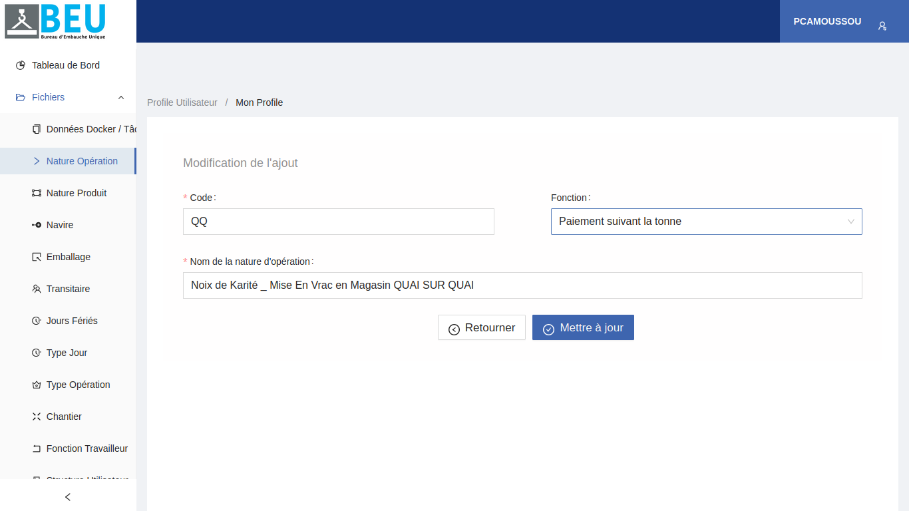
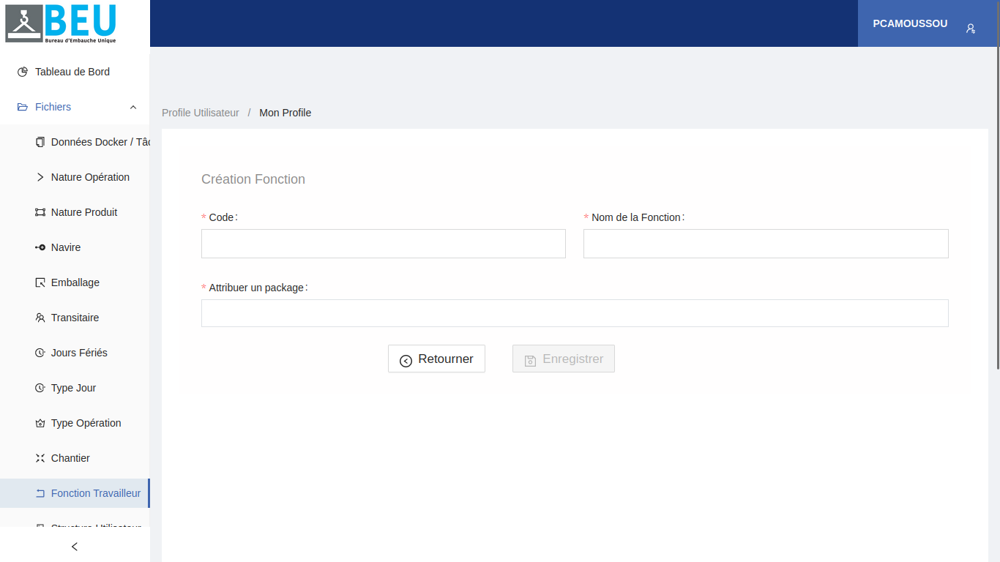
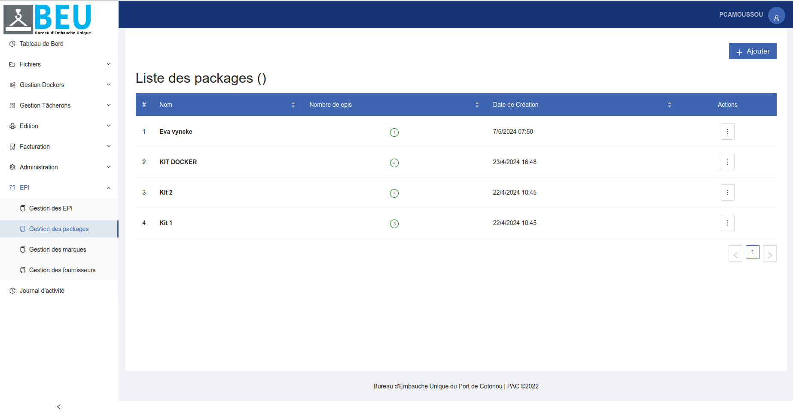

# Bureau d'Embauche Unique (BEU) - Documentation

## Page de connexion

La page de connexion vous permet d'accéder à votre compte BEU en entrant vos identifiants. Voici les éléments clés de cette page :

1. **Logo BEU**: Le logo de l'application Bureau d'Embauche Unique.
2. **Champ d'identifiant**: Entrez votre identifiant.
3. **Champ de mot de passe**: Entrez votre mot de passe.
4. **Lien "Mot de passe oublié ?"**: Cliquez sur ce lien si vous avez oublié votre mot de passe.
5. **Bouton "Se Connecter"**: Cliquez sur ce bouton une fois vos identifiants entrés pour vous connecter.

Une fois connecté, vous pourrez accéder aux différentes fonctionnalités de l'application BEU.

## Accéder au profil

Pour accéder à votre profil utilisateur, cliquez sur le menu latéral "Profils Utilisateur" > "Mon Profil" comme illustré ci-dessous :

Vous pouviez également vous déconnectez en cliquant sur "déconnexion"

## Afficher les informations de profil

La section "Mon Profil" affiche les informations détaillées de votre compte utilisateur, notamment :

- Nom et prénoms
- Rôle au sein de l'application
- Structure à laquelle vous appartenez

## Modifier le profil

Pour modifier les informations de votre profil, cliquez sur le bouton "Modifier" et changer les informations au niveau des champs du formulaire voulu.

Une fois les modifications apportées, cliquez sur "Mettre à jour" pour enregistrer les changements.

## Liste des dockers et tâcherons

Cette section permet de consulter et rechercher la liste complète des dockers et tâcherons enregistrés dans le système.

### Filtres de recherche

Plusieurs filtres sont disponibles pour faciliter la recherche de dockers ou tâcherons spécifiques : Cliquer sur le bouton "Cliquez ici pour faire une recherche avancée" pour rechercher.

- **Badge** : Rechercher par le numéro de badge.
- **Matricule** : Rechercher par le matricule.
- **Numéro d'appel** : Rechercher par le numéro d'appel.
- **Nom** : Rechercher par le nom.
- **Prénoms** : Rechercher par les prénoms.
- **Téléphone** : Rechercher par le numéro de téléphone.
- **Fonction** : Rechercher par la fonction occupée.

### Résultats

La liste affiche les informations suivantes pour chaque docker ou tâcheron :

- **Badge** : Le numéro de badge attribué.
- **Nom** : Le nom de famille.
- **Prénoms** : Les prénoms.
- **Statut** : Le statut actuel (libre ou occupé).
- **Matricule** : Le matricule d'identification.
- **Téléphone** : Le numéro de téléphone.
- **Fonction** : La fonction occupée.
- **Action** : Un bouton d'action permettant d'accéder aux détails ou de modifier les informations.

- Par contre , cliquer sur le bouton de suppression supprimera le docker ou le tacheron.

## Liste des natures d'opération

La page de liste des natures d'opération affiche toutes les natures d'opération existantes dans un tableau. Chaque ligne du tableau contient les informations suivantes :

- Code
- Nom de la nature d'opération
- Type de paie
- Date de création
- Actions (Modifier, Supprimer)

### Modification d'une Nature d'Opération

Pour modifier une nature d'opération :

1. Cliquez sur le bouton de modification (icône de crayon) situé dans la colonne "Actions" de la ligne correspondant à la nature d'opération que vous souhaitez modifier.
2. Vous serez redirigé vers une page de modification.
3. Modifiez les informations souhaitées et cliquez sur le bouton "Mettre à jour" pour sauvegarder les modifications.

### Suppression d'une Nature d'Opération

Pour supprimer une nature d'opération :

1. Cliquez sur le bouton de suppression (icône de poubelle) situé dans la colonne "Actions" de la ligne correspondant à la nature d'opération que vous souhaitez supprimer.
2. Une confirmation peut être demandée.
3. La nature d'opération sera supprimée de la liste.

### Ajouter une nature d'opération

Pour ajouter une nouvelle nature d'opération , cliquez sur le bouton d'ajout "Ajouter nature d'opération" en haut à gauche. Cela vous redirigera vers une page ou vous remplirez le formulaire d'ajout et cliquerez sur le bouton "Enregistrer"

## Liste des natures de produit

La page de liste des natures de produit affiche toutes les natures de produit existantes dans un tableau. Chaque ligne du tableau contient les informations suivantes :

- Code
- Nom de la nature de produit
- Date de création
- Actions (Modifier, Supprimer)

### Modification d'une Nature de produit

Pour modifier une nature de produit :

1. Cliquez sur le bouton de modification (icône de crayon) situé dans la colonne "Actions" de la ligne correspondant à la nature de produit que vous souhaitez modifier.
2. Vous serez redirigé vers une page de modification.
3. Modifiez les informations souhaitées et cliquez sur le bouton "Mettre à jour" pour sauvegarder les modifications.

### Suppression d'une Nature de produit

Pour supprimer une nature de produit :

1. Cliquez sur le bouton de suppression (icône de poubelle) situé dans la colonne "Actions" de la ligne correspondant à la nature de produit que vous souhaitez supprimer.
2. Une confirmation peut être demandée.
3. La nature de produit sera supprimée de la liste.

### Ajouter une nature de produit

Pour ajouter une nouvelle nature de produit , cliquez sur le bouton d'ajout "Ajouter nature de produit" en haut à gauche. Cela vous redirigera vers une page ou vous remplirez le formulaire d'ajout et cliquerez sur le bouton "Enregistrer"

## Navire

La page de liste des navires affiche tous les navires existantes dans le système dans un tableau. Chaque ligne du tableau contient les informations suivantes :

- Code OMI
- Nom du navire
- Actions (Modifier, Supprimer)

### Modification d'un navire

Pour modifier un navire:

1. Cliquez sur le bouton de modification (icône de crayon) situé dans la colonne "Actions" de la ligne correspondant au navire que vous souhaitez modifier.
2. Vous serez redirigé vers une page de modification.
3. Modifiez les informations souhaitées et cliquez sur le bouton "Mettre à jour" pour sauvegarder les modifications.

### Suppression d'un navires

Pour supprimer un navire :

1. Cliquez sur le bouton de suppression (icône de poubelle) situé dans la colonne "Actions" de la ligne correspondant au navire que vous souhaitez supprimer.
2. Une confirmation peut être demandée.
3. Le navire sera supprimé de la liste.

### Ajouter un navire

Pour ajouter un nouveau navire , cliquez sur le bouton d'ajout "Ajouter un navire" en haut à gauche. Cela vous redirigera vers une page ou vous remplirerez le formulaire d'ajout et cliquerez sur le bouton "Enregistrer"

### Rechercher un navire

Pour rechercher un navire , entrez dans le formulaire de recherche le nom ou le code OMI du navire. Cliquez ensuite sur le bouton de recherche.
La liste des navires trouvés s'affichera dans le tableau.

## Emballage

La page de liste des emballages affiche toutes les emballages existantes dans le système dans un tableau. Chaque ligne du tableau contient les informations suivantes :

- Nom de l'emballage
- Date de création
- Actions (Modifier, Supprimer)

### Modification d'une emballage

Pour modifier une emballage:

1. Cliquez sur le bouton de modification (icône de crayon) situé dans la colonne "Actions" de la ligne correspondant à l'emballage que vous souhaitez modifier.
2. Vous serez redirigé vers une page de modification.
3. Modifiez les informations souhaitées et cliquez sur le bouton "Mettre à jour" pour sauvegarder les modifications.

### Suppression d'une emballage

Pour supprimer une emballage :

1. Cliquez sur le bouton de suppression (icône de poubelle) situé dans la colonne "Actions" de la ligne correspondant à l'emballage que vous souhaitez supprimer.
2. Une confirmation peut être demandée.
3. L'emballage sera supprimée de la liste.

### Ajouter une emballage

Pour ajouter une nouvelle emballage , cliquez sur le bouton d'ajout "Ajouter" en haut gauche. Cela vous redirigera vers une page ou vous remplirerez le formulaire d'ajout et cliquerez sur le bouton "Enregistrer"

### Rechercher une emballage

Pour rechercher une emballage, entrez dans le formulaire de recherche le nom ou le nom de l'emballage. Cliquez ensuite sur le bouton de recherche.
La liste des emballages trouvées s'affichera dans le tableau.

## Transitaire

La page de liste des transitaires affiche tous les transitaires existantes dans le système dans un tableau. Chaque ligne du tableau contient les informations suivantes :

- Nom & prénoms
- Téléphone
- adresse
- Numéro IFU
- Actions (Modifier, Supprimer)

### Modification d'un transitaire

Pour modifier un transitaire:

1. Cliquez sur le bouton de modification (icône de crayon) situé dans la colonne "Actions" de la ligne correspondant au transitaire que vous souhaitez modifier.
2. Vous serez redirigé vers une page de modification.
3. Modifiez les informations souhaitées et cliquez sur le bouton "Mettre à jour" pour sauvegarder les modifications.

### Suppression d'un transitaire

Pour supprimer un transitaire :

1. Cliquez sur le bouton de suppression (icône de poubelle) situé dans la colonne "Actions" de la ligne correspondant au transitaire que vous souhaitez supprimer.

2. Une confirmation peut être demandée.
3. Le transitaire sera supprimé de la liste.

### Ajouter un transitaire

Pour ajouter un nouveau transitaire , cliquez sur le bouton d'ajout "Ajouter un transitaire" en haut à gauche. Cela vous redirigera vers une page ou vous remplirerez le formulaire d'ajout et cliquerez sur le bouton "Enregistrer"

### Rechercher un transitaire

Pour rechercher un transitaire , entrez dans le formulaire de recherche le nom ou autre information du transitaire. Cliquez ensuite sur le bouton de recherche.
La liste des transitaires trouvés s'affichera dans le tableau.

## Jour fériés

La page de liste des jours fériés affiche tous les jours fériés existants dans le système dans un tableau. Chaque ligne du tableau contient les informations suivantes :

- Jour férié
- Date
- Type de jour
- Date de création
- Actions (Modifier, Supprimer)

### Modification d'un jour férié

Pour modifier un jour férié:

1. Cliquez sur le bouton de modification (icône de crayon) situé dans la colonne "Actions" de la ligne correspondant au jour férié que vous souhaitez modifier.
2. Vous serez redirigé vers une page de modification.
3. Modifiez les informations souhaitées et cliquez sur le bouton "Mettre à jour" pour sauvegarder les modifications.

### Suppression d'un jour férié

Pour supprimer un jour férié :

1. Cliquez sur le bouton de suppression (icône de poubelle) situé dans la colonne "Actions" de la ligne correspondant au jour férié que vous souhaitez supprimer.
2. Une confirmation peut être demandée.
3. Le jour férié sera supprimé de la liste.

### Ajouter un jour férié

Pour ajouter un nouveau jour férié , cliquez sur le bouton d'ajout "Ajouter" en haut à gauche. Cela vous redirigera vers une page ou vous remplirerez le formulaire d'ajout et cliquerez sur le bouton "Enregistrer"

### Rechercher un jour férié

Pour rechercher un navire , entrez dans le formulaire de recherche la date ou autre information du jour férié. Cliquez ensuite sur le bouton de recherche.
La liste des jours fériés trouvés s'affichera dans le tableau.

## Type de jour

La page de liste des jours affiche tous les types de jours existants dans le système dans un tableau. Chaque ligne du tableau contient les informations suivantes :

- Code
- Type de jour
- Date de création
- Actions (Modifier, Supprimer)

### Modification d'un jour

Pour modifier un jour:

1. Cliquez sur le bouton de modification (icône de crayon) situé dans la colonne "Actions" de la ligne correspondant au jour que vous souhaitez modifier.
2. Vous serez redirigé vers une page de modification.
3. Modifiez les informations souhaitées et cliquez sur le bouton "Mettre à jour" pour sauvegarder les modifications.

### Suppression d'un jour

Pour supprimer un jour :

1. Cliquez sur le bouton de suppression (icône de poubelle) situé dans la colonne "Actions" de la ligne correspondant au navire que vous souhaitez supprimer.
2. Une confirmation peut être demandée.
3. Le jour sera supprimé de la liste.

### Ajouter un jour

Pour ajouter un nouveau jour , cliquez sur le bouton d'ajout "Ajouter" en haut à gauche. Cela vous redirigera vers une page ou vous remplirerez le formulaire d'ajout et cliquerez sur le bouton "Enregistrer"

### Rechercher un jour

Pour rechercher un jour , entrez dans le formulaire de recherche la date ou le autre information du jour. Cliquez ensuite sur le bouton de recherche.
La liste des jours trouvés s'affichera dans le tableau.

## Type d'opération

La page de liste des types opérations affiche tous les opérations existantes dans le système dans un tableau. Chaque ligne du tableau contient les informations suivantes :

- Code
- Type d'opération
- Date de création
- Actions (Modifier, Supprimer)

### Modification d'un opération

Pour modifier un opération:

1. Cliquez sur le bouton de modification (icône de crayon) situé dans la colonne "Actions" de la ligne correspondant à l'opération que vous souhaitez modifier.
2. Vous serez redirigé vers une page de modification.
3. Modifiez les informations souhaitées et cliquez sur le bouton "Mettre à jour" pour sauvegarder les modifications.

### Suppression d'une opération

Pour supprimer un navire :

1. Cliquez sur le bouton de suppression (icône de poubelle) situé dans la colonne "Actions" de la ligne correspondant à l'opération que vous souhaitez supprimer.
2. Une confirmation peut être demandée.
3. L'opération sera supprimé de la liste.

### Ajouter une opération

Pour ajouter une nouvelle opération , cliquez sur le bouton d'ajout "Ajouter" en haut à gauche. Cela vous redirigera vers une page ou vous remplirerez le formulaire d'ajout et cliquerez sur le bouton "Enregistrer"

### Rechercher une opération

Pour rechercher un navire , entrez dans le formulaire de recherche le code ou autre information de l'opération. Cliquez ensuite sur le bouton de recherche.
La liste des opérations trouvées s'affichera dans le tableau.

## Chantier

La page de liste des chantiers affiche tous les chantiers existantes dans le système dans un tableau. Chaque ligne du tableau contient les informations suivantes :

- Code
- chantier
- Date de création
- Actions (Modifier, Supprimer)

### Modification d'un chantier

Pour modifier un chantier:

1. Cliquez sur le bouton de modification (icône de crayon) situé dans la colonne "Actions" de la ligne correspondant au chantier que vous souhaitez modifier.
2. Vous serez redirigé vers une page de modification.
3. Modifiez les informations souhaitées et cliquez sur le bouton "Mettre à jour" pour sauvegarder les modifications.

### Suppression d'un chantier

Pour supprimer un chantier :

1. Cliquez sur le bouton de suppression (icône de poubelle) situé dans la colonne "Actions" de la ligne correspondant au chantier que vous souhaitez supprimer.
2. Une confirmation peut être demandée.
3. Le chantier sera supprimé de la liste.

### Ajouter un chantier

Pour ajouter un nouveau chantier , cliquez sur le bouton d'ajout "Ajouter" en haut à gauche. Cela vous redirigera vers une page ou vous remplirerez le formulaire d'ajout et cliquerez sur le bouton "Enregistrer"

### Rechercher un chantier

Pour rechercher un chantier , entrez dans le formulaire de recherche le nom ou le code du chantier. Cliquez ensuite sur le bouton de recherche.
La liste des chantiers trouvés s'affichera dans le tableau.

## Fonction travailleur

La page de liste des fonctions des travailleurs affiche tous les fonctions des travailleurs existantes dans le système dans un tableau. Chaque ligne du tableau contient les informations suivantes :

- Code
- Foncion docker
- date de création
- Actions (Modifier, Supprimer)

### Modification d'une fonction des travailleurs

Pour modifier une fonction:

1. Cliquez sur le bouton de modification (icône de crayon) situé dans la colonne "Actions" de la ligne correspondant à la fonction que vous souhaitez modifier.
2. Vous serez redirigé vers une page de modification.
3. Modifiez les informations souhaitées et cliquez sur le bouton "Mettre à jour" pour sauvegarder les modifications.

### Suppression d'une fonction

Pour supprimer une fonction :

1. Cliquez sur le bouton de suppression (icône de poubelle) situé dans la colonne "Actions" de la ligne correspondant à la fonction que vous souhaitez supprimer.
2. Une confirmation peut être demandée.
3. La fonction sera supprimé de la liste.

### Ajouter une fonction

Pour ajouter une nouvelle fonction , cliquez sur le bouton d'ajout "Ajouter" en haut à gauche. Cela vous redirigera vers une page ou vous remplirerez le formulaire d'ajout et cliquerez sur le bouton "Enregistrer"

### Rechercher une fonction

Pour rechercher un navire , entrez dans le formulaire de recherche la fonction ou le code de la fonction. Cliquez ensuite sur le bouton de recherche.
La liste des fonctions trouvéss s'affichera dans le tableau.

## Structure utilisateur

La page de liste des navires affiche tous les navires existantes dans le système dans un tableau. Chaque ligne du tableau contient les informations suivantes :

- Nom de la structure
- adresse
- Actions (Modifier, Supprimer)

### Modification d'une structure

Pour modifier une structure:

1. Cliquez sur le bouton de modification (icône de crayon) situé dans la colonne "Actions" de la ligne correspondant a la structure que vous souhaitez modifier.
2. Vous serez redirigé vers une page de modification.
3. Modifiez les informations souhaitées et cliquez sur le bouton "Mettre à jour" pour sauvegarder les modifications.

### Suppression d'une structure

Pour supprimer un navire :

1. Cliquez sur le bouton de suppression (icône de poubelle) situé dans la colonne "Actions" de la ligne correspondant a la structure que vous souhaitez supprimer.
2. Une confirmation peut être demandée.
3. La structure sera supprimé de la liste.

### Ajouter une structure

Pour ajouter une nouvelle structure , cliquez sur le bouton d'ajout "Ajouter un navire" en haut à gauche. Cela vous redirigera vers une page ou vous remplirerez le formulaire d'ajout et cliquerez sur le bouton "Enregistrer"

### Rechercher une structure

Pour rechercher une structure , entrez dans le formulaire de recherche le nom ou l'adresse de la structure. Cliquez ensuite sur le bouton de recherche.
La liste des structures trouvées s'affichera dans le tableau.

# Gestion Dockers

## Liste des demandes de docker

Cette section permet de consulter et rechercher la liste complète des demandes de dockers enregistrées dans le système, ou d'en ajouter de nouvelles. Chaque ligne du tableau contient les informations suivantes : 

-Référence
-Création
-Navire
-Chantier
-Opération
-Date
-Heure
-Effectif
-Statut
-Actions : Un bouton d'action permettant d'accéder aux détails, de confirmer, d'annuler ou de modifier les informations, ou encore de clôturer une demande si elle est déjà en cours d'exécution.

### Filtres de recherche

Plusieurs filtres sont disponibles pour faciliter la recherche d'une demande de docker spécifique : Cliquer sur le bouton "Cliquez ici pour faire une recherche avancée" pour rechercher.

- **Références** : Rechercher par le numéro de demande.
- **Société** : Rechercher par le nom de la société.
- **Navire** : Rechercher par le nom du navire.
- **Chantier** : Rechercher par le nom du chantier.
- **Opération** : Rechercher par le type d'opération.
- **Début période** : Rechercher par la date de début.
- **Fin période** : Rechercher par la date de fin.
- **Statut** : Rechercher par le statut de la demande.

### Résultats

La liste affiche les informations suivantes pour chaque docker:
- **Références** : Le numéro de demande attribué.
- **Société** : Le nom de la société.
- **Navire** : Le nom du navire. 
- **Chantier** : Le nom du chantier.
- **Opération** : Le type d'opération.
- **Début période** : La date de début.
- **Fin période** : La date de fin.
- **Statut** : Le statut de la demande.

### Création de demande Docker
Pour ajouter une nouvelle demande docker, cliquez sur le bouton d'ajout "Nouvelle demande" en haut à droite. Cela vous redirigera vers une page où vous remplirez le formulaire de création et ensuite vous cliquerez sur le bouton "Enregistrer"

## Modifier une demande Docker
Pour modifier les informations d'une demande Docker, cliquez sur le bouton "Modifier" et changer les informations au niveau des champs du formulaire voulu.
Une fois les modifications apportées, cliquez sur "Mettre à jour" pour enregistrer les changements.

### Suppression d'une demande Docker
Pour supprimer une demande Docker :
1. Cliquez sur le bouton Annuler en rouge (avec une icône de poubelle) situé dans la colonne "Actions" de la ligne correspondant à la demande Docker que vous souhaitez supprimer.
2. Une confirmation peut être demandée.
3. La demande Docker sera supprimée de la liste.

## Liste des demandes Dockers en attente

La page de liste des demandes Dockers affiche toutes les demandes Dockers en attente dans un tableau. Chaque ligne du tableau contient les informations suivantes :
-Référence
-Demandeur
-Navire
-Chantier
-Opération
-Date
-Effectif
-Statut
-Actions (recruter, changer le statut)

### Filtres de recherche

Plusieurs filtres sont disponibles pour faciliter la recherche d'une demande docker en attente : Cliquer sur le bouton "Cliquez ici pour faire une recherche avancée" pour rechercher.

- **Référence** : Rechercher par la référence.
- **Société** : Rechercher par le nom de la société.
- **Navire** : Rechercher par le nom du navire.
- **Début période** : Rechercher par la date de début.
- **Fin période** : Rechercher par la date de fin.
- **Statut** : Rechercher par le statut de la demande.

### Résultats

La liste affiche les informations suivantes pour chaque demande docker en attente :
- **Références** : Le numéro de demande attribué.
- **Société** : Le nom de la société.
- **Navire** : Le nom du navire. 
- **Début période** : La date de début.
- **Fin période** : La date de fin.
- **Statut** : Le statut de la demande.
- **Actions** : Un bouton d'action permettant le changer de statut ou de recruter.

## Liste des embauches Dockers

La page de liste des embauches Dockers affiche toutes les embauches Dockers existantes dans un tableau. Chaque ligne du tableau contient les informations suivantes :
- Référence
- Opération
- Début
- Fin
- Effectif
- Demandeur
- Statut
- Actions (Détails, Activer Badges, Changer le statut, Supprimer)

### Suppression d'une embauche Docker...
Pour supprimer une embauche Docker :
1. Cliquez sur le bouton "Supprimer" situé dans la colonne "Action" de la ligne correspondant à l'embauche Docker que vous souhaitez supprimer.
2. Une confirmation peut être demandée.
3. L'embauche Docker sera supprimée de la liste.

### Embauches à Démarrer

Cette section affiche la liste des embauches de dockers qui sont prêtes à être démarrées.

#### Filtres de recherche

Plusieurs filtres sont disponibles pour faciliter la recherche d'une embauche à démarrer :

- **Références** : Rechercher par le numéro de demande.
- **Société** : Rechercher par le nom de la société.
- **Navire** : Rechercher par le nom du navire.
- **Chantier** : Rechercher par le nom du chantier.
- **Opération** : Rechercher par le type d'opération.
- **Début période** : Rechercher par la date de début.
- **Fin période** : Rechercher par la date de fin.

#### Résultats

La liste affiche les informations suivantes pour chaque embauche à démarrer :

- **Références** : Le numéro de demande attribué.
- **Société** : Le nom de la société.
- **Navire** : Le nom du navire.
- **Chantier** : Le nom du chantier.
- **Opération** : Le type d'opération.
- **Début période** : La date de début.
- **Fin période** : La date de fin.
- **Actions** : Un bouton d'action permettant de démarrer l'embauche.

### Embauches à Exécuter

Cette section affiche la liste des embauches de dockers qui sont prêtes à être exécutées.

#### Filtres de recherche

Plusieurs filtres sont disponibles pour faciliter la recherche d'une embauche à exécuter :

- **Références** : Rechercher par le numéro de demande.
- **Société** : Rechercher par le nom de la société.
- **Début période** : Rechercher par la date de début.
- **Fin période** : Rechercher par la date de fin.

#### Résultats

La liste affiche les informations suivantes pour chaque embauche à exécuter :

- **Références** : Le numéro de demande attribué.
- **Société** : Le nom de la société.
- **Début période** : La date de début.
- **Fin période** : La date de fin.

### Embauches à Clôturer

Cette section affiche la liste des embauches de dockers qui sont prêtes à être clôturées.

#### Filtres de recherche  

Plusieurs filtres sont disponibles pour faciliter la recherche d'une embauche à clôturer :

- **Références** : Rechercher par le numéro de demande.
- **Société** : Rechercher par le nom de la société.
- **Navire** : Rechercher par le nom du navire.
- **Chantier** : Rechercher par le nom du chantier.
- **Opération** : Rechercher par le type d'opération. 
- **Début période** : Rechercher par la date de début.
- **Fin période** : Rechercher par la date de fin.

#### Résultats

La liste affiche les informations suivantes pour chaque embauche à clôturer :

- **Références** : Le numéro de demande attribué.
- **Société** : Le nom de la société.
- **Navire** : Le nom du navire.
- **Chantier** : Le nom du chantier.
- **Opération** : Le type d'opération.
- **Début période** : La date de début. 
- **Fin période** : La date de fin.
- **Actions** : Un bouton d'action permettant de clôturer l'embauche.

### Embauches à Payer

Cette section affiche la liste des embauches de dockers qui sont prêtes à être payées.

#### Filtres de recherche

Plusieurs filtres sont disponibles pour faciliter la recherche d'une embauche à payer :

- **Références** : Rechercher par le numéro de demande.
- **Société** : Rechercher par le nom de la société.
- **Navire** : Rechercher par le nom du navire.
- **Chantier** : Rechercher par le nom du chantier.
- **Opération** : Rechercher par le type d'opération.
- **Début période** : Rechercher par la date de début.
- **Fin période** : Rechercher par la date de fin.

#### Résultats

La liste affiche les informations suivantes pour chaque embauche à payer :

- **Références** : Le numéro de demande attribué.
- **Société** : Le nom de la société. 
- **Navire** : Le nom du navire.
- **Chantier** : Le nom du chantier.
- **Opération** : Le type d'opération.
- **Début période** : La date de début.
- **Fin période** : La date de fin.
- **Montant** : Le montant total à payer pour l'embauche.

### Embauches Payées  

Cette section affiche la liste des embauches de dockers qui ont été payées.

#### Filtres de recherche

Plusieurs filtres sont disponibles pour faciliter la recherche d'une embauche payée :

- **Références** : Rechercher par le numéro de demande.
- **Société** : Rechercher par le nom de la société.
- **Navire** : Rechercher par le nom du navire.
- **Chantier** : Rechercher par le nom du chantier.
- **Opération** : Rechercher par le type d'opération.
- **Début période** : Rechercher par la date de début.
- **Fin période** : Rechercher par la date de fin.
- **Date de paiement** : Rechercher par la date de paiement.

#### Résultats

La liste affiche les informations suivantes pour chaque embauche payée :

- **Références** : Le numéro de demande attribué.
- **Société** : Le nom de la société.
- **Navire** : Le nom du navire.
- **Chantier** : Le nom du chantier.
- **Opération** : Le type d'opération. 
- **Début période** : La date de début.
- **Fin période** : La date de fin.
- **Montant** : Le montant total payé pour l'embauche.
- **Date de paiement** : La date à laquelle l'embauche a été payée.

### Paie Docker

Cette section permet de gérer la paie des dockers embauchés.

#### Filtres de recherche

Plusieurs filtres sont disponibles pour faciliter la recherche :

- **Nom** : Rechercher par le nom du docker.
- **Prénom** : Rechercher par le prénom du docker.
- **Période de paie** : Rechercher par la période de paie.

#### Résultats

La liste affiche les informations suivantes pour chaque docker :

- **Nom** : Le nom du docker.
- **Prénom** : Le prénom du docker.
- **Heures travaillées** : Le nombre d'heures travaillées pendant la période.
- **Taux horaire** : Le taux horaire du docker.
- **Montant dû** : Le montant total à payer au docker pour la période.

# Gestion Tâcherons

## Liste des demandes de tâcherons

Cette section permet de consulter et rechercher la liste complète des demandes de tâcherons enregistrées dans le système. Chaque ligne du tableau contient les informations suivantes :

-Référence
-Création
-Navire
-Chantier
-Opération
-Demandeur
-N° Conteneur 
-Produit
-Quantité
-Statut
-Actions

### Filtres de recherche

Plusieurs filtres sont disponibles pour faciliter la recherche d'une demande de tâcheron spécifique : Cliquer sur le bouton "Cliquez ici pour faire une recherche avancée" pour rechercher.

- **Référence** : Rechercher par le numéro de demande.
- **Nature Opération** : Rechercher par le type d'opération.
- **Début période** : Rechercher par la date de début.
- **Fin période** : Rechercher par la date de fin.

### Résultats

La liste affiche les informations suivantes pour chaque tâcheron:
- **Référence** : Le numéro de demande attribué.
- **Nature Opération** : La nature de l'opération.
- **Date début prévu** : La date de début prévu.
- **Date fin prévu** : La date de fin prévu.

## Modifier une demande de tâcheron 
Pour modifier les informations d'une demande de tâcheron, cliquez sur le bouton "Modifier" et changer les informations au niveau des champs du formulaire voulu.
Une fois les modifications apportées, cliquez sur "Mettre à jour" pour enregistrer les changements.

### Suppression d'une demande de tâcheron
Pour supprimer une demande de tâcheron :
1. Cliquez sur le bouton Annuler (avec une icône de poubelle) situé dans la colonne "Actions" de la ligne correspondant à la demande de tâcheron que vous souhaitez supprimer.
2. Une confirmation peut être demandée.
3. La demande de tâcheron sera supprimée de la liste.

## Liste des demandes de tâcherons en attente

La page de liste des demandes Dockers affiche toutes les demandes Dockers en attente dans un tableau. Chaque ligne du tableau contient les informations suivantes :
-Référence
-Création
-Navire
-Chantier
-Opération
-Demandeur
-N° Conteneur 
-Produit
-Quantité
-Statut
-Actions

### Filtres de recherche

Plusieurs filtres sont disponibles pour faciliter la recherche d'une demande de tâcheron en attente : Cliquer sur le bouton "Cliquez ici pour faire une recherche avancée" pour rechercher.

- **Référence** : Rechercher par la référence.
- **Société** : Rechercher par le nom de la société.
- **Navire** : Rechercher par le nom du navire.
- **Début période** : Rechercher par la date de début.
- **Fin période** : Rechercher par la date de fin.
- **Statut** : Rechercher par le statut de la demande.

### Résultats

La liste affiche les informations suivantes pour chaque demande de tâcheron en attente :
- **Références** : Le numéro de demande attribué.
- **Société** : Le nom de la société.
- **Navire** : Le nom du navire. 
- **Début période** : La date de début.
- **Fin période** : La date de fin.
- **Statut** : Le statut de la demande.

## Liste des demandes de tâcherons

La page de liste des demandes de tâcherons affiche toutes les demandes de tâcherons existantes dans un tableau. Chaque ligne du tableau contient les informations suivantes :
-Référence
-Création
-Navire
-Chantier
-Opération
-Demandeur
-N° Conteneur 
-Produit
-Quantité
-Statut

### Embauches à Démarrer

Cette section affiche la liste des demandes de tâcherons pêtes à être démarées.

#### Filtres de recherche

Plusieurs filtres sont disponibles pour faciliter la recherche d'une demande de tâcheron :

- **Références** : Rechercher par le numéro de demande.
- **Société** : Rechercher par le nom de la société.
- **Navire** : Rechercher par le nom du navire.
- **Chantier** : Rechercher par le nom du chantier.
- **Opération** : Rechercher par le type d'opération.
- **Début période** : Rechercher par la date de début.
- **Fin période** : Rechercher par la date de fin.

#### Résultats

La liste affiche les informations suivantes pour chaque demande de tâcheron :

- **Références** : Le numéro de demande attribué.
- **Société** : Le nom de la société.
- **Navire** : Le nom du navire.
- **Chantier** : Le nom du chantier.
- **Opération** : Le type d'opération.
- **Début période** : La date de début.
- **Fin période** : La date de fin.
- **Actions** : Un bouton d'action permettant de démarrer l'embauche.

### Embauches à Exécuter

Cette section affiche la liste des embauches de tâcheron qui sont prêtes à être exécutées.

#### Filtres de recherche

Plusieurs filtres sont disponibles pour faciliter la recherche d'une embauche de tâcheron à exécuter :

- **Références** : Rechercher par le numéro de demande.
- **Société** : Rechercher par le nom de la société.
- **Début période** : Rechercher par la date de début.
- **Fin période** : Rechercher par la date de fin.

#### Résultats

La liste affiche les informations suivantes pour chaque embauche de tâcheron à exécuter :

- **Références** : Le numéro de demande attribué.
- **Société** : Le nom de la société.
- **Début période** : La date de début.
- **Fin période** : La date de fin.

### Embauches à Clôturer

Cette section affiche la liste des embauches de tâcherons qui sont prêtes à être clôturées.

#### Filtres de recherche  

Plusieurs filtres sont disponibles pour faciliter la recherche d'une embauche de tâcheron à clôturer :

- **Références** : Rechercher par le numéro de demande.
- **Société** : Rechercher par le nom de la société.
- **Navire** : Rechercher par le nom du navire.
- **Chantier** : Rechercher par le nom du chantier.
- **Opération** : Rechercher par le type d'opération. 
- **Début période** : Rechercher par la date de début.
- **Fin période** : Rechercher par la date de fin.

#### Résultats

La liste affiche les informations suivantes pour chaque embauche de tâcheron à clôturer :

- **Références** : Le numéro de demande attribué.
- **Société** : Le nom de la société.
- **Navire** : Le nom du navire.
- **Chantier** : Le nom du chantier.
- **Opération** : Le type d'opération.
- **Début période** : La date de début. 
- **Fin période** : La date de fin.
- **Actions** : Un bouton d'action permettant de clôturer l'embauche.

### Embauches à Payer

Cette section affiche la liste des embauches de tâcherons qui sont prêtes à être payées.

#### Filtres de recherche

Plusieurs filtres sont disponibles pour faciliter la recherche d'une embauche à payer :

- **Références** : Rechercher par le numéro de demande.
- **Société** : Rechercher par le nom de la société.
- **Navire** : Rechercher par le nom du navire.
- **Chantier** : Rechercher par le nom du chantier.
- **Opération** : Rechercher par le type d'opération.
- **Début période** : Rechercher par la date de début.
- **Fin période** : Rechercher par la date de fin.

#### Résultats

La liste affiche les informations suivantes pour chaque embauche de tâcheron à payer :

- **Références** : Le numéro de demande attribué.
- **Société** : Le nom de la société. 
- **Navire** : Le nom du navire.
- **Chantier** : Le nom du chantier.
- **Opération** : Le type d'opération.
- **Début période** : La date de début.
- **Fin période** : La date de fin.
- **Montant** : Le montant total à payer pour l'embauche.

### Embauches Payées  

Cette section affiche la liste des embauches de tâcherons qui ont été payées.

#### Filtres de recherche

Plusieurs filtres sont disponibles pour faciliter la recherche d'une embauche de tâcheron déjà payée :

- **Références** : Rechercher par le numéro de demande.
- **Société** : Rechercher par le nom de la société.
- **Navire** : Rechercher par le nom du navire.
- **Chantier** : Rechercher par le nom du chantier.
- **Opération** : Rechercher par le type d'opération.
- **Début période** : Rechercher par la date de début.
- **Fin période** : Rechercher par la date de fin.
- **Date de paiement** : Rechercher par la date de paiement.

#### Résultats

La liste affiche les informations suivantes pour chaque embauche payée :

- **Références** : Le numéro de demande attribué.
- **Société** : Le nom de la société.
- **Navire** : Le nom du navire.
- **Chantier** : Le nom du chantier.
- **Opération** : Le type d'opération. 
- **Début période** : La date de début.
- **Fin période** : La date de fin.
- **Montant** : Le montant total payé pour l'embauche.
- **Date de paiement** : La date à laquelle l'embauche a été payée.

### Paie Tâcheron

Cette section permet de gérer la paie des tâcherons embauchés.

#### Filtres de recherche

Plusieurs filtres sont disponibles pour faciliter la recherche :

- **Référence** : Rechercher par la référence de la demande.
- **Société** : Rechercher par le nom de la société.
- **Nature Opération** : Rechercher par la nature de l'opération.
- **Date début** : Rechercher par la date de début.
- **Date fin** : Rechercher par la date de fin.

#### Résultats

La liste affiche les informations suivantes pour chaque tâcheron :

**Référence** : La référence de la demande.
**Société** : Le nom de la société.
**Nature Opération** : La nature de l'opération. 
**Date début** : La date de début de la période.
**Date fin** : La date de fin de la période.

## FICHE DE PAIE

### Liste des travailleurs

La page de liste des travailleurs affiche tous les navires existantes dans le système dans un tableau. Chaque ligne du tableau contient les informations suivantes :

- Badge
- Nom du travailleur
- Prénoms
- Matricule
- Téléphone
- Fonction
- Actions (Imprimer)

### Fiche de paie

On peut imprimer ou voir la fiche de paie d'un travailleur donné au bout d'une période donnée en entrant la date de début et la date de fin et en cliquant sur le bouton imprimer de la colonne "Action" sur la ligne du travailleur.

# Facturation

## Liste des factures périodiques

Cette section permet de consulter la liste complète factures périodiques enregistrées dans le système. Chaque ligne du tableau contient les informations suivantes :

-Date Facture
-Référence
-Société
-Montant TTC
-Période
-Statut
-Actions

### Filtres de recherche

Plusieurs filtres sont disponibles pour faciliter la recherche d'une demande de tâcheron spécifique : Cliquer sur le bouton "Cliquez ici pour faire une recherche avancée" pour rechercher.

- **Société** : Rechercher par le nom de la société.
- **Début période** : Rechercher par la date de début.
- **Fin période** : Rechercher par la date de fin.
- **Facture** : Rechercher par la facture.

### Résultats

La liste affiche les informations suivantes pour chaque tâcheron:
- **Société** : Le nom de la société.
- **Début Période** : La date de début de la période.
- **Fin Période** : La date de fin de la période.
- **Facture** : Le numéro de la facture.

## Liste des Factures à Venir

La page de liste des factures à venir affiche toutes les factures à venir, dans un tableau. Chaque ligne du tableau contient les informations suivantes :
-Date
-Salaire
-CNSS
-VPS
-Total
-Origine

### Filtres de recherche

Plusieurs filtres sont disponibles pour faciliter la recherche d'une facture à venir

- **Société** : Rechercher par le nom de la société.
- **Début période** : Rechercher par la date de début.
- **Fin période** : Rechercher par la date de fin.
- **Facture** : Rechercher par le numéro facture.

### Résultats

La liste affiche les informations suivantes pour chaque demande de tâcheron en attente :

- **Société** : Le nom de la société.
- **Début période** : La date de début.
- **Fin période** : La date de fin.
- **Facture** : La facture de la demande.

# Administration

## Gestion des utilisateurs

Cette section permet de consulter la liste complète des utilisateurs enregistrés dans le système. Chaque ligne du tableau contient les informations suivantes :

-Nom
-Prénoms
-Nom d'utilisateur
-Email
-Structure
-Role
-Statut
-Actions (Editer, Désactiver, Supprimer)

### Filtres de recherche

Plusieurs filtres sont disponibles pour faciliter la recherche d'un utilisateur spécifique : Cliquer sur le bouton "Cliquez ici pour faire une recherche avancée" pour rechercher.

- **Nom** : Rechercher par le nom de l'utilisateur.
- **Prénoms** : Rechercher par les prénoms de l'utilisateur.
- **Nom d'utilisateur** : Rechercher par le nom d'utilisateur.
- **Email** : Rechercher par email.
- **Structure** : Rechercher par la structure.
- **Role** : Rechercher par le rôle.
- **Statut** : Rechercher par le statut.

### Résultats

La liste affiche les informations suivantes pour l'utilisateur recherché:
- **Nom** : Le nom de l'utilisateur.
- **Prénoms** : Prénoms de l'utilisateur.
- **Nom d'utilisateur** : Le nom d'utilisateur.
- **Email** : L'email de l'utilisateur.
- **Structure** : La structure de l'utilisateur.
- **Role** : Le rôle de l'utilisateur.
- **Statut** : Le statut de l'utilisateur recherché.
0
!0[Liste des utilisateurs](userlist.png)

### Ajouter un utilisateur
Pour ajouter une nouvel utilisateur, cliquez sur le bouton d'ajout "Ajouter" en haut à droite. Cela vous redirigera vers une page où vous remplirez le formulaire de création et ensuite vous cliquerez sur le bouton "Enregistrer"

## Gestion des rôles

La page de liste des rôles affiche tous les rôles en attente dans un tableau. Chaque ligne du tableau contient les informations suivantes :
- **Nom** 
- **Description** 
- **Nombre de permisions**
- **Actions** 

### Filtres de recherche

Plusieurs filtres sont disponibles pour faciliter la recherche d'un rôle : Cliquer sur le bouton "Cliquez ici pour faire une recherche avancée" pour rechercher.

- **Nom** : Rechercher par la référence.
- **Description** : Rechercher par le nom de la société.
- **Nombre de permisions** : Rechercher par le nom du navire.

### Résultats

La liste affiche les informations suivantes pour chaque demande de tâcheron en attente :
- **Nom** : La nom du rôle.
- **Description** : Description du rôle.
- **Nombre de permisions** : Le nombre de permissions.

### Ajouter un rôle
Pour ajouter une nouveau rôle, cliquez sur le bouton d'ajout "Nouvelle demande" en haut à droite. Cela vous redirigera vers une page où vous remplirez le formulaire d'ajout et ensuite vous cliquerez sur le bouton "Enregistrer"

## Grille Dockers

Cette section permet de consulter la liste des grilles dockers enregistrés dans le système. Chaque ligne du tableau contient les informations suivantes :

-Shift
-Fonction travailleur
-Type opération
-Type jour
-Taux
-Actions

### Filtres de recherche

Plusieurs filtres sont disponibles pour faciliter la recherche d'une grille docker spécifique : Cliquer sur le bouton "Cliquez ici pour faire une recherche avancée" pour rechercher.

- **Shift** : Rechercher par le nom de l'utilisateur.
- **Fonction travailleur** : Rechercher par les prénoms de l'utilisateur.
- **Type opération** : Rechercher par le nom d'utilisateur.
- **Type jour** : Rechercher par email.
- **Taux** : Rechercher par la structure.

### Résultats

La liste affiche les informations suivantes pour la grille docker recherchée:
- **Shift** : Shift de la grille docker.
- **Fonction travailleur** : La fonction du travailleur.
- **Type opération** : Le type d'opération.
- **Type jour** : Le type jour.
- **Taux** : Le taux de la grille docker.

### Ajouter une nouvelle grille docker
Pour ajouter une nouvelle grille docker, cliquez sur le bouton d'ajout "Ajouter" en haut à droite. Cela vous redirigera vers une page où vous remplirez le formulaire d'ajout et ensuite vous cliquerez sur le bouton "Enregistrer".

## Barèmes tâcherons

Cette section permet de consulter la liste des barèmes tâcherons enregistrés dans le système. Chaque ligne du tableau contient les informations suivantes :

-Nature opération
-Nature produit
-Prix unitaire
-Actions

### Filtres de recherche

Plusieurs filtres sont disponibles pour faciliter la recherche d'une grille docker spécifique : Cliquer sur le bouton "Cliquez ici pour faire une recherche avancée" pour rechercher.

- **Nature opération** : Rechercher par la nature de l'opération.
- **Nature produit** : Rechercher par la nature du produit.
- **Prix unitaire** : Rechercher par le prix unitaire.

### Résultats

La liste affiche les informations suivantes pour le barème tâcheron recherché :
- **Nature opération** : La nature de l'opération.
- **Nature produit** : La nature du produit.
- **Prix unitaire** : Le prix unitaire.

### Ajouter un nouveau barème tâcheron
Pour ajouter un nouveau barème tâcheron, cliquez sur le bouton d'ajout "Ajouter" en haut à droite. Cela vous redirigera vers une page où vous remplirez le formulaire d'ajout et ensuite vous cliquerez sur le bouton "Enregistrer".

## Equipe tâcheron

Cette section permet de consulter la liste des équipes  de tâcherons enregistrées dans le système. Chaque ligne du tableau contient les informations suivantes :

-Code
-Nom 
-Prénoms
-Téléphone
-Date
-Statut
-Actions

### Filtres de recherche

Plusieurs filtres sont disponibles pour faciliter la recherche d'une grille docker spécifique : Cliquer sur le bouton "Cliquez ici pour faire une recherche avancée" pour rechercher.

- **Code** : Rechercher par le code.
- **Nom responsable** : Rechercher par le nom du responsable.
- **Prénom responsable** : Rechercher par le prénom du responsable.
- **Téléphone** : Rechercher par le numéro de téléphone.

### Résultats

La liste affiche les informations suivantes pour l'équipe tâcheron recherchée :
- **Code** : Le code de l'équipe tâcheron.
- **Nom responsable** : Le nom du responsable.
- **Prénom responsable** : Le prénom du responsable.
- **Téléphone** : Le numéro de téléphone.

### Ajouter une nouvelle équipe tâcheron
Pour ajouter une nouvelle équipe tâcheron, cliquez sur le bouton d'ajout "Ajouter" en haut à droite. Cela vous redirigera vers une page où vous remplirez le formulaire d'ajout et ensuite vous cliquerez sur le bouton "Enregistrer".

## Equipe type docker

Cette section permet de consulter la liste des équipes type docker enregistrées dans le système. Chaque ligne du tableau contient les informations suivantes :

-Code
-Description
-Taille
-Date
-Statut
-Actions

### Filtres de recherche

Plusieurs filtres sont disponibles pour faciliter la recherche d'une équipe docker docker spécifique : Cliquer sur le bouton "Cliquez ici pour faire une recherche avancée" pour rechercher.

- **Code** : Rechercher par le code.
- **Description** : Rechercher par la description de l'équipe
- **Taille** : Rechercher par la taille.  
- **Date** : Rechercher par la date d'enrégistrement.
- **Statut** : Rechercher par le statut de l'équipe.

### Résultats

La liste affiche les informations suivantes pour l'équipe tâcheron recherchée :
- **Code** : Le code.
- **Description** : La description de l'équipe.
- **Taille** : La taille.  
- **Date** : La date d'enrégistrement.
- **Statut** : Le statut de l'équipe.

### Ajouter une nouvelle équipe type docker
Pour ajouter une nouvelle équipe type docker, cliquez sur le bouton d'ajout "Ajouter" en haut à droite. Cela vous redirigera vers une page où vous remplirez le formulaire d'ajout et ensuite vous cliquerez sur le bouton "Enregistrer".

## Paramétrage système

Cette section permet de consulter la liste des paramétrages système enregistrées dans le système. Chaque ligne du tableau contient les informations suivantes :

-Code
-Nom 
-Prénoms
-Téléphone
-Date
-Statut
-Actions

### Filtres de recherche

Plusieurs filtres sont disponibles pour faciliter la recherche d'un paramétrage système spécifique : Cliquer sur le bouton "Cliquez ici pour faire une recherche avancée" pour rechercher.

- **Code** : Rechercher par le code.
- **Nom du responsable** : Rechercher par la description de l'équipe
- **Prénoms du responsable** : Rechercher par la taille.  
- **Téléphone** : Rechercher par la taille.  
- **Date** : Rechercher par la date d'enrégistrement.
- **Statut** : Rechercher par le statut.

### Résultats

La liste affiche les informations suivantes pour le paramétrage système recherché :
- **Code** : Le code.
- **Nom du responsable** : Le nom du responsable
- **Prénoms du responsable** : Prénoms du responsable.  
- **Téléphone** : Le numéro de téléphone.  
- **Date** : La date d'enrégistrement.
- **Statut** : Le statut du paramétrage système.

### Ajouter un nouveau paramétrage système
Pour ajouter un nouveau paramétrage système, cliquez sur le bouton d'ajout "Ajouter" en haut à droite. Cela vous redirigera vers une page où vous remplirez le formulaire d'ajout et ensuite vous cliquerez sur le bouton "Enregistrer".

# EPI

## Gestion des EPI

Cette section permet de consulter la liste des epis enregistrés dans le système. Chaque ligne du tableau contient les informations suivantes :

-Nom 
-Description
-Date de création
-Actions (Gestion du stock, Modifier, Supprimer).

### Ajouter un nouvel epi
Pour ajouter un nouvel epi, cliquez sur le bouton d'ajout "Ajouter" en haut à droite. Cela vous redirigera vers une page où vous remplirez le formulaire d'ajout et ensuite vous cliquerez sur le bouton "Enregistrer".

## Gestion des packages

Cette section permet de consulter la liste des epis enregistrés dans le système. Chaque ligne du tableau contient les informations suivantes :

-Nom 
-Nombre de epis
-Date de création
-Actions

### Ajouter un nouveau package
Pour ajouter un nouveau package, cliquez sur le bouton d'ajout "Ajouter" en haut à droite. Cela vous redirigera vers une page où vous remplirez le formulaire d'ajout et ensuite vous cliquerez sur le bouton "Enregistrer".

# Gestion des marques

Cette section permet de consulter la liste des marques enregistrées dans le système. Chaque ligne du tableau contient les informations suivantes :

-Nom 
-Date de création
-Actions

### Ajouter un nouvelle marque
Pour ajouter une nouvelle marque, cliquez sur le bouton d'ajout "Ajouter" en haut à droite. Cela vous redirigera vers une page où vous remplirez le formulaire d'ajout et ensuite vous cliquerez sur le bouton "Enregistrer".

# Gestion des fournisseurs 

Cette section permet de consulter la liste des fournisseurs enregistrés dans le système. Chaque ligne du tableau contient les informations suivantes :

-Nom 
-Contacte
-Adresse
-Date de création
-Actions

### Ajouter un nouveau fournisseur
Pour ajouter un nouveau fournisseur, cliquez sur le bouton d'ajout "Ajouter" en haut à droite. Cela vous redirigera vers une page où vous remplirez le formulaire d'ajout et ensuite vous cliquerez sur le bouton "Enregistrer".

# Journal d'activité

Cette section permet de consulter la liste de journal d'activités enregistrés dans le système. 

